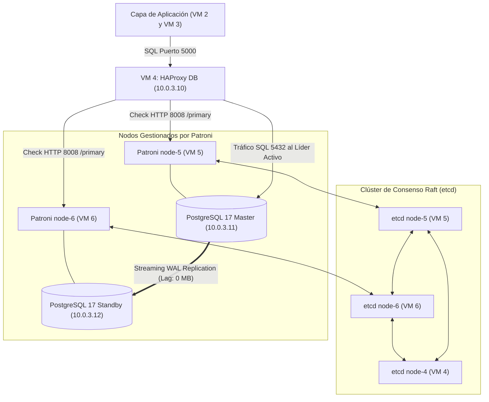

# Documentación Técnica: Capa de Base de Datos de Alta Disponibilidad y Failover Automático
## Plataforma SIG - Cementerio General Comuna de Los Ángeles
**Infraestructura:** Google Cloud Platform (Compute Engine) — Sin Contenedores (Nativo en Debian 13)  
**Tecnologías:** PostgreSQL 17, PostGIS 3.5, Patroni 3.x, etcd 3.5, HAProxy 2.8  
**Fecha:** Septiembre 2026  

---

## 1. Resumen Ejecutivo de la Arquitectura

Para cumplir con los requerimientos de **Alta Disponibilidad (HA)**, **Tolerancia a Fallos** y **Cero Pérdida de Datos** sin incurrir en costos elevados, se implementó un clúster distribuido en la subred privada `subnet-db` (`10.0.3.0/24`).

### Componentes de la Capa de Datos:
1. **VM 4 (`vm-db-haproxy` - 10.0.3.10):**
   - **HAProxy L4 (TCP):** Punto de entrada único para la aplicación. Enruta escrituras al Master (puerto 5000) y lecturas a las réplicas (puerto 5001).
   - **Nodo Árbitro de etcd (`node-4`):** Actúa como tercer miembro del quórum de consenso sin costo adicional.
   - **Dashboard Web de Monitoreo:** Expuesto en el puerto 7000.
2. **VM 5 (`vm-db-master` - 10.0.3.11):**
   - **PostgreSQL 17 + PostGIS 3:** Base de datos relacional y geoespacial.
   - **Patroni (`node-5`):** Agente supervisor y gestor del ciclo de vida de PostgreSQL.
   - **Nodo de etcd (`node-5`):** Segundo miembro del clúster de consenso.
3. **VM 6 (`vm-db-replica` - 10.0.3.12):**
   - **PostgreSQL 17 + PostGIS 3:** Réplica de streaming física de solo lectura.
   - **Patroni (`node-6`):** Agente preparado para auto-promoción automática.
   - **Nodo de etcd (`node-6`):** Primer miembro del clúster de consenso.

---

## 2. Diagrama de Flujo y Topología de Red



---

## 3. Matriz de Direccionamiento IP y Puertos

| Máquina Virtual | Rol Principal | IP Privada | Puertos Abiertos / Servicios |
| :--- | :--- | :--- | :--- |
| **`vm-db-haproxy`** | Proxy / Árbitro | `10.0.3.10` | • `5000` (Escritura SQL)<br>• `5001` (Lectura SQL)<br>• `7000` (Dashboard Web)<br>• `2379/2380` (etcd) |
| **`vm-db-master`** | DB Primaria / Patroni | `10.0.3.11` | • `5432` (PostgreSQL)<br>• `8008` (Patroni REST API)<br>• `2379/2380` (etcd) |
| **`vm-db-replica`** | DB Réplica / Patroni | `10.0.3.12` | • `5432` (PostgreSQL)<br>• `8008` (Patroni REST API)<br>• `2379/2380` (etcd) |

---

## 4. Reglas de Firewall Requeridas en Google Cloud

Ejecutadas en Google Cloud Shell sobre la red `subnet-db`:

```bash
# 1. Permitir comunicación interna total en la red de datos (etcd, postgres, patroni)
gcloud compute firewall-rules create allow-internal-db \
    --network=subnet-db \
    --allow=tcp,udp,icmp \
    --source-ranges=10.0.0.0/16 \
    --description="Trafico interno cluster BD"

# 2. Permitir acceso al panel visual de HAProxy (puerto 7000)
gcloud compute firewall-rules create allow-haproxy-stats-db \
    --network=subnet-db \
    --allow=tcp:7000 \
    --source-ranges=0.0.0.0/0 \
    --description="Panel estadisticas HAProxy"
```

---

## 5. Configuración Detallada por Componente

### A. Clúster de Consenso `etcd` (3 Nodos)
Instalado vía `apt install -y etcd-server etcd-client`.
Archivo: `/etc/default/etcd`

* **En VM 4 (`10.0.3.10`):**
  ```bash
  ETCD_NAME="node-4"
  ETCD_DATA_DIR="/var/lib/etcd/default.etcd"
  ETCD_LISTEN_PEER_URLS="http://10.0.3.10:2380"
  ETCD_LISTEN_CLIENT_URLS="http://10.0.3.10:2379,http://127.0.0.1:2379"
  ETCD_INITIAL_ADVERTISE_PEER_URLS="http://10.0.3.10:2380"
  ETCD_ADVERTISE_CLIENT_URLS="http://10.0.3.10:2379"
  ETCD_INITIAL_CLUSTER="node-4=http://10.0.3.10:2380,node-5=http://10.0.3.11:2380,node-6=http://10.0.3.12:2380"
  ETCD_INITIAL_CLUSTER_TOKEN="etcd-cementerio-token"
  ETCD_INITIAL_CLUSTER_STATE="new"
  ```
* **En VM 5 (`10.0.3.11`):** Idéntico cambiando `ETCD_NAME="node-5"` y las URLs a `10.0.3.11`.
* **En VM 6 (`10.0.3.12`):** Idéntico cambiando `ETCD_NAME="node-6"` y las URLs a `10.0.3.12`.

---

### B. Orquestador de Failover `Patroni` (VM 5 y VM 6)
Instalado vía `apt install -y patroni python3-psycopg2 python3-etcd`.  
Archivo: `/etc/patroni/config.yml` (Permisos `chown postgres:postgres`, `chmod 600`).  
> **Nota crítica:** El servicio `postgresql.service` nativo de systemd fue deshabilitado (`systemctl disable postgresql`) para que Patroni gestione el proceso y los directorios de forma exclusiva.

* **Estructura en VM 5 (`node-5`):**
  ```yaml
  scope: cementerio-cluster
  namespace: /service
  name: node-5

  restapi:
    listen: 10.0.3.11:8008
    connect_address: 10.0.3.11:8008

  etcd:
    hosts:
      - 10.0.3.10:2379
      - 10.0.3.11:2379
      - 10.0.3.12:2379

  bootstrap:
    dcs:
      ttl: 30
      loop_wait: 10
      retry_timeout: 10
      maximum_lag_on_failover: 1048576
      postgresql:
        use_pg_rewind: true
        use_slots: true
        parameters:
          listen_addresses: '*'
          wal_level: replica
          max_wal_senders: 10
          max_replication_slots: 10
          hot_standby: 'on'

    initdb:
      - encoding: UTF8
      - data-checksums

    pg_hba:
      - host replication replicator 10.0.3.0/24 md5
      - host all all 10.0.0.0/16 md5
      - host all all 127.0.0.1/32 trust

  postgresql:
    listen: 10.0.3.11:5432
    connect_address: 10.0.3.11:5432
    data_dir: /var/lib/postgresql/17/patroni
    bin_dir: /usr/lib/postgresql/17/bin
    pgpass: /var/lib/postgresql/.pgpass
    authentication:
      replication:
        username: replicator
        password: ReplicaPassword123!
      superuser:
        username: postgres
        password: PostgresPassword123!

  tags:
    nofailover: false
    noloadbalance: false
    clonefrom: false
    nosync: false
  ```
* **En VM 6 (`node-6`):** Idéntico sustituyendo `name: node-6`, y las IPs de `restapi` y `postgresql` por `10.0.3.12`.

---

### C. Proxy de Conexión HAProxy (VM 4)
Archivo: `/etc/haproxy/haproxy.cfg`

```haproxy
global
    log /dev/log local0
    user haproxy
    group haproxy
    daemon

defaults
    log global
    mode tcp
    option tcplog
    retries 3
    timeout connect 10s
    timeout client 30m
    timeout server 30m
    timeout check 5s

# PUERTO 5000: ESCRITURA Y LECTURA PRINCIPAL
frontend postgres_write_front
    bind *:5000
    mode tcp
    default_backend postgres_write_back

backend postgres_write_back
    mode tcp
    option httpchk GET /primary
    http-check expect status 200
    default-server inter 3s fall 3 rise 2 on-marked-down shutdown-sessions
    server node5 10.0.3.11:5432 maxconn 100 check port 8008
    server node6 10.0.3.12:5432 maxconn 100 check port 8008

# PUERTO 5001: LECTURA BALANCEADA ENTRE RÉPLICAS
frontend postgres_read_front
    bind *:5001
    mode tcp
    default_backend postgres_read_back

backend postgres_read_back
    mode tcp
    balance roundrobin
    option httpchk GET /replica
    http-check expect status 200
    default-server inter 3s fall 3 rise 2
    server node5 10.0.3.11:5432 maxconn 100 check port 8008
    server node6 10.0.3.12:5432 maxconn 100 check port 8008

# DASHBOARD WEB VISUAL (PUERTO 7000)
listen stats
    mode http
    bind *:7000
    stats enable
    stats uri /
    stats refresh 5s
```

---

## 6. Base de Datos Inicializada
Dentro del clúster de Patroni se ejecutó:
```sql
CREATE DATABASE cementerio_db;
\c cementerio_db
CREATE EXTENSION IF NOT EXISTS postgis;
CREATE USER app_user WITH ENCRYPTED PASSWORD 'AppPassword123!';
GRANT ALL PRIVILEGES ON DATABASE cementerio_db TO app_user;
GRANT ALL ON SCHEMA public TO app_user;
```

---

## 7. Pruebas y Validación de Tolerancia a Fallos

### Prueba 1: Quórum de Consenso
```bash
etcdctl endpoint health --endpoints=http://10.0.3.10:2379,http://10.0.3.11:2379,http://10.0.3.12:2379
```
*Resultado:* Los 3 nodos responden `is healthy` en < 8 ms.

### Prueba 2: Estado del Clúster Patroni
```bash
sudo patronictl -c /etc/patroni/config.yml list
```
*Resultado Inicial:*
- `node-5` (10.0.3.11) | Role: **Leader** | State: **running**
- `node-6` (10.0.3.12) | Role: **Replica** | State: **streaming** | Lag: **0 MB**

### Prueba 3: Simulación de Caída del Master (Failover en Vivo)
1. Se apagó la instancia `vm-db-master` desde Google Cloud Compute Engine.
2. En menos de 5 segundos, `node-6` detectó la pérdida de latido en `etcd`.
3. `node-6` se auto-ascendió a **Leader**.
4. HAProxy detectó que `node-6` respondió `HTTP 200` en `/primary` y colocó a `node6` en **UP (Verde)** en el puerto 5000.
5. Al reencender `vm-db-master`, Patroni en `node-5` detectó al líder activo y se reincorporó automáticamente como **Replica**, sin división cerebral (*Split-Brain*) y sin intervención de un operador humano.
